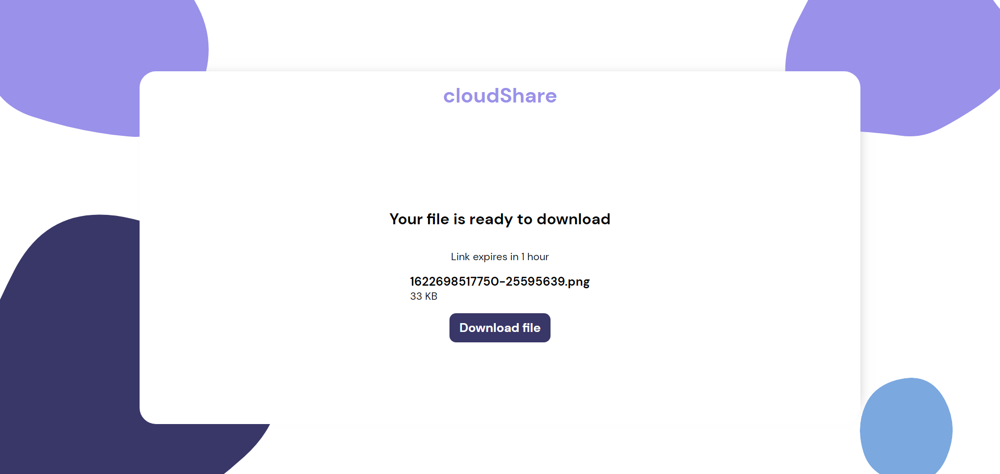

# RESTFUL cloudShare api

This a restful api created as backend support for cloudShare service.
This api store the files to database and mails the file's remote url to desired user.

##

```
NPM packages used
- cors
- dotenv
- ejs
- mongoose
- multer
- nodemailer
- uuid
```

## Screenshots


