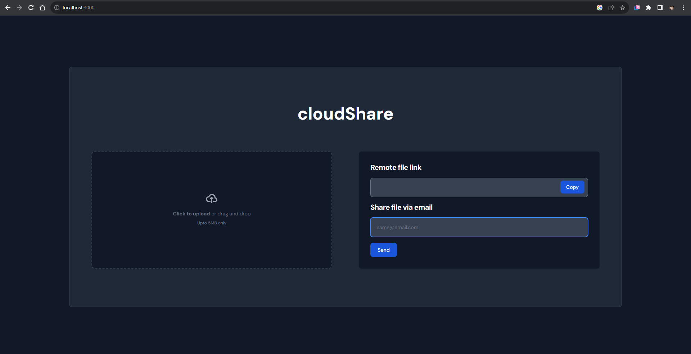
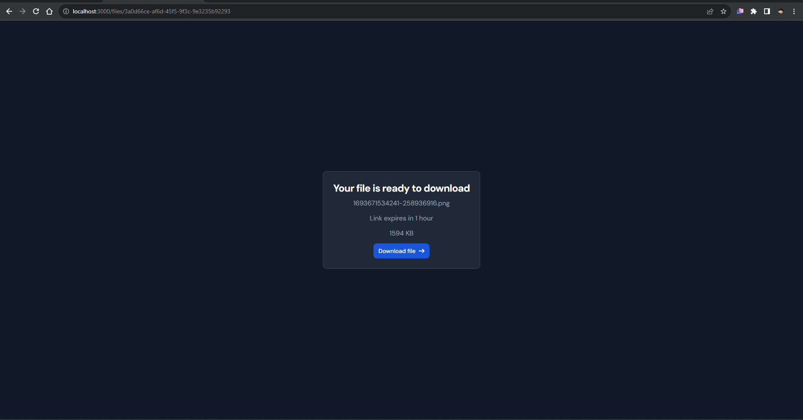

# File Sharing App with REST API


This is an online file-sharing application with a RESTful API. It allows users to securely upload and download files in a collaborative environment
<br/>
Check out the live demo of the FileShare App: [Demo](https://cloudshare-api.onrender.com)


## Introduction
## Features

- Secure file upload and download.
- Share files with other users via shareable link and email.
- Detailed API documentation.
- Easy-to-use web interface.
- Shareable link valid for 1 hour
- File limit: 5MB
## Getting Started

### Prerequisites

Before you begin, ensure you have met the following requirements:

- [Node.js](https://nodejs.org/) installed.
- [MongoDB](https://www.mongodb.com/) installed and running.

### Installation

1. Clone the repository:

   ```bash
   git clone https://github.com/ad1tyaSharma/file-sharing.git
   ```
2. Navigate to the project directory:
   ```bash
   npm i
   ```
3. Configure the environment variables by creating a `.env` file in the root directory.
4. Start the application:
    ``` bash
      npm run dev
    ```
### Usage
1. Access the application by visiting `http://localhost:3000` in your web browser.
2. Start uploading and managing your files.
### Contributing
Contributions are welcome! If you find any issues or want to enhance the app, feel free to open a pull request. Make sure to follow the existing coding style and add appropriate tests for your changes.
1. Fork the repository.
2. Create a new branch.
3. Make your changes and commit them.
4. Push the changes to your fork.
5. Open a pull request explaining your changes.


